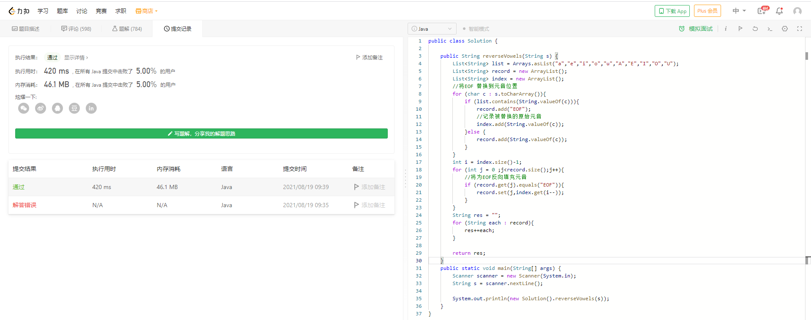

# 345. 反转字符串中的元音字母

## 用时记录
> 开始 2021-08-19 09-10:00
> 结束 2021-08-19 09-40:00  用时30m
> 
## 题目说明
```java
编写一个函数，以字符串作为输入，反转该字符串中的元音字母。

 

示例 1：

输入："hello"
输出："holle"
示例 2：

输入："leetcode"
输出："leotcede"
 

提示：

元音字母不包含字母 "y" 。

来源：力扣（LeetCode）
链接：https://leetcode-cn.com/problems/reverse-vowels-of-a-string
著作权归领扣网络所有。商业转载请联系官方授权，非商业转载请注明出处。
```

```JAVA
public class Solution {

    public String reverseVowels(String s) {
        List<String> list = Arrays.asList("a","e","i","o","u","A","E","I","O","U");
        List<String> record = new ArrayList();
        List<String> index = new ArrayList();
        //将EOF 替换到元音位置
        for (char c : s.toCharArray()){
            if (list.contains(String.valueOf(c))){
                record.add("EOF");
                //记录被替换的原始元音
                index.add(String.valueOf(c));
            }else {
                record.add(String.valueOf(c));
            }
        }
        int i = index.size()-1;
        for (int j = 0 ;j<record.size();j++){
            //将为EOF反向填充元音
            if (record.get(j).equals("EOF")){
                record.set(j,index.get(i--));
            }
        }
        String res = "";
        for (String each : record){
            res+=each;
        }

        return res;
    }
    public static void main(String[] args) {
        Scanner scanner = new Scanner(System.in);
        String s = scanner.nextLine();

        System.out.println(new Solution().reverseVowels(s));
    }
}
```

## 提交结果



